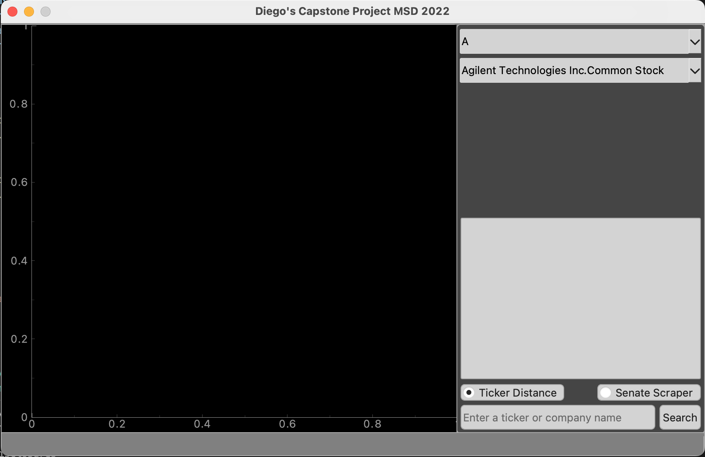
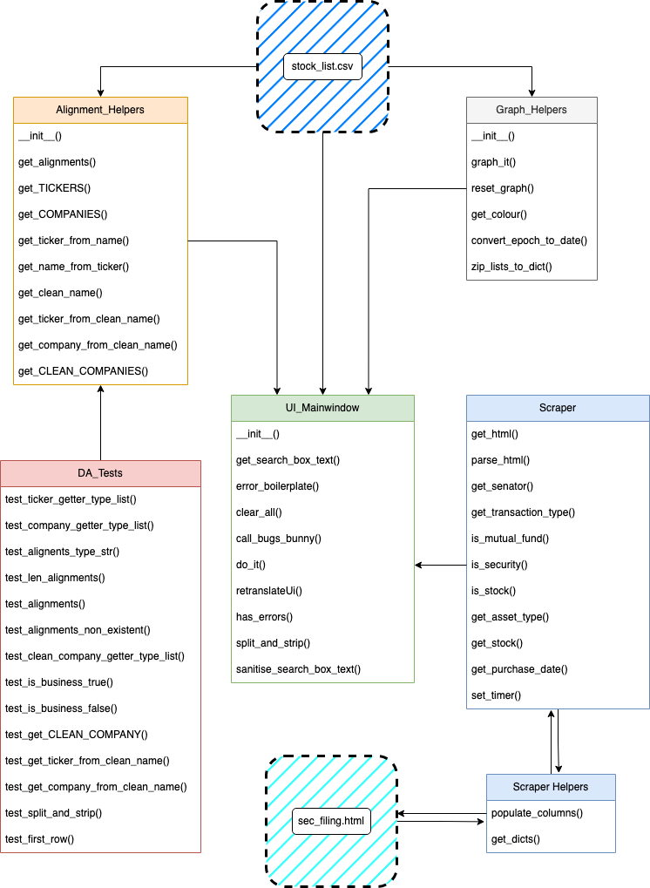

# Diego's Capstone Project MSD 2022

## Distance Arbitrage aka Distarb

## [License](https://github.com/Daegybyte/distarb/blob/main/LICENSE)

## Deliverables:
	
* ### [Paper](https://github.com/Daegybyte/distarb/tree/main/paper/)

* ### [Presentation](https://youtu.be/1874lj_r0Ko)

* ### [Release](https://github.com/Daegybyte/distarb/releases)

## Instructions:

In the program window, select the radio button for what functionality you are interested in. 

The default button on the left is to figure out the edit distance using the distance calculating algorithm. The results will be ranked by edit and physical distance. 

The two dropdowns at the top allow you to select a company by either its company name, or its ticker name. The right radio button activates the webscraper.

### Why doesn't this work?

#### In the event the executable fails:
 try:
 
 - Right clicking the application and clicking run. This will circumvent Apple trying to protect you from unidentified developers.

#### If that fails:

 - In your terminal, navigate to where you see '`distarb.app`' and run the script: 
 
 		$bash distarb.app/Contents/MacOS/distarb
 
It is worth noting that this may be necessary to get the webscraper to work.
 
 
#### If all of the above fails:

1. Get [Anaconda](https://anaconda.org/).

2. A `.yml` of the conda environement to run the application can be found [here](https://anaconda.org/daegybyte/distarb).

	recreate the environment with:
	
		$conda env create --file distarb.yml

3. Download [Source Code Zip](https://github.com/Daegybyte/distarb/releases/tag/v1.1.1) from my repo.

4. Follow [this walkthrough](https://dschreij.github.io/how-to/package-anaconda-environments-as-apps) walkthrough to create your own exectuable. 

## Class diagram:

### Bug Reporting:

Please report all bugs to [@elonmusk](https://twitter.com/elonmusk/with_replies?lang=en) on Twitter.

### Miscellaneous:

#### [app/](https://github.com/Daegybyte/distarb/tree/main/app)

* Contains copies of the source code in `distarb.app/Contents/Resources/app/`.

 
#### No animals were harmed in the making of this program. However, [one particularly happy corgi named Doc](https://www.youtube.com/watch?v=dQw4w9WgXcQ) received heaps of treats from the treat jar on my desk. As a result, he is becoming a bit of a chunk. 