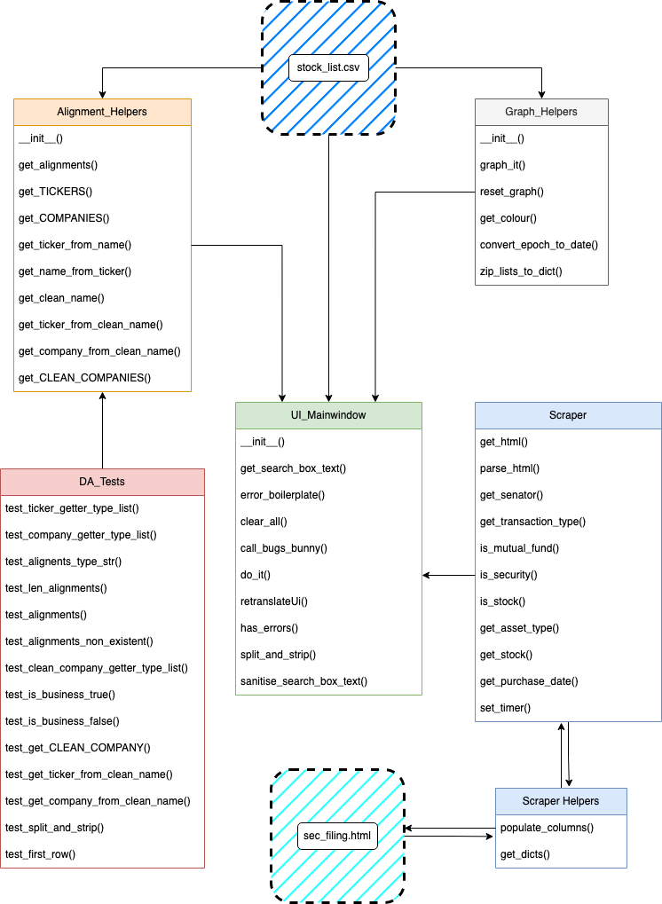
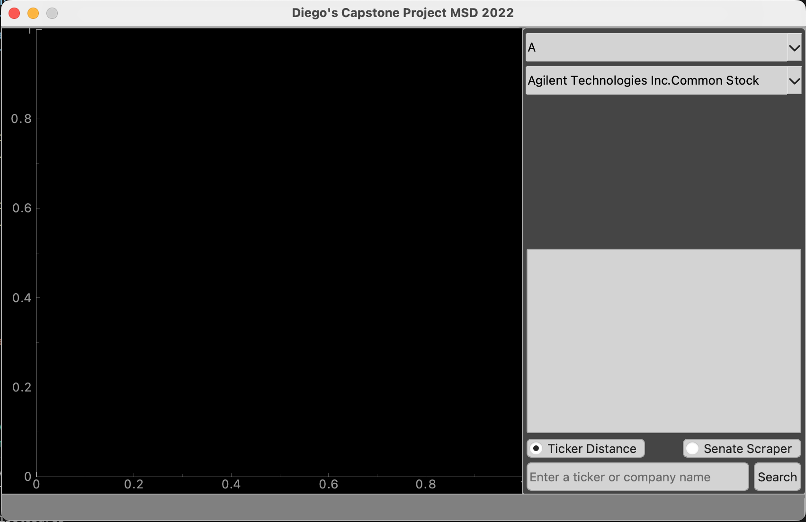

# Distance Arbitrage (Distarb)

A Python desktop application that ranks stock ticker symbols and company names by
keyboard-layout-aware edit distance. Built as a capstone project for the University of Utah Master
of Software Engineering program.

## Overview

Distarb explores the idea that typos in stock ticker searches are not random — they are influenced
by the physical proximity of keys on a keyboard. The app combines string edit distance with QWERTY
key-distance weighting to surface the most likely intended ticker or company name from a potentially
mistyped input.

It also includes an SEC congressional trading disclosure scraper, allowing users to explore recent
stock transactions made by U.S. senators.

## Features

- Keyboard-weighted edit distance ranking of ticker symbols
- Company name fuzzy search using cleaned string matching
- SEC congressional trading disclosure scraper
- Interactive PyQt5 GUI with live graph output via PyQtGraph
- 28 unit tests with CI via GitHub Actions

## Tech Stack

Python, PyQt5, PyQtGraph, pandas, yfinance, BeautifulSoup, pendulum, clavier (vendored)

## Getting Started

Recommended: use the provided conda environment.

    conda create -n distarb python=3.9.15
    conda activate distarb
    python -m pip install -r requirements.txt
    python app/main.py

Or run directly if dependencies are already installed:

    python app/main.py

macOS note: if a packaged .app release fails to open, right-click and select Open, or run from
terminal:

    bash distarb.app/Contents/MacOS/distarb

## Running Tests

    python -m pytest app/tests.py -v

## Class Diagram

## App Screenshot

## Deliverables

- [Research Paper](https://github.com/Daegybyte/distarb/tree/main/paper/)
- [Presentation](https://youtu.be/1874lj_r0Ko)
- [Release](https://github.com/Daegybyte/distarb/releases)

## License

[MIT](https://github.com/Daegybyte/distarb/blob/main/LICENSE)

---

No animals were harmed in the making of this program. However,
[one particularly happy corgi named Doc](https://www.youtube.com/watch?v=dQw4w9WgXcQ) received heaps
of treats from the treat jar on my desk. As a result, he is becoming a bit of a chunk.
